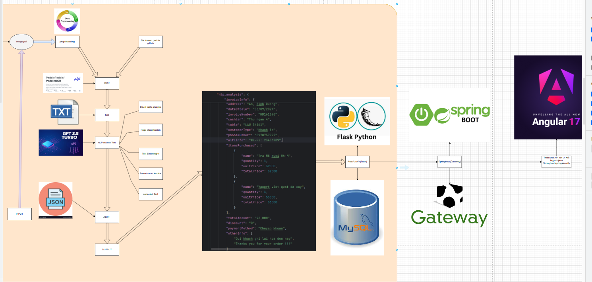
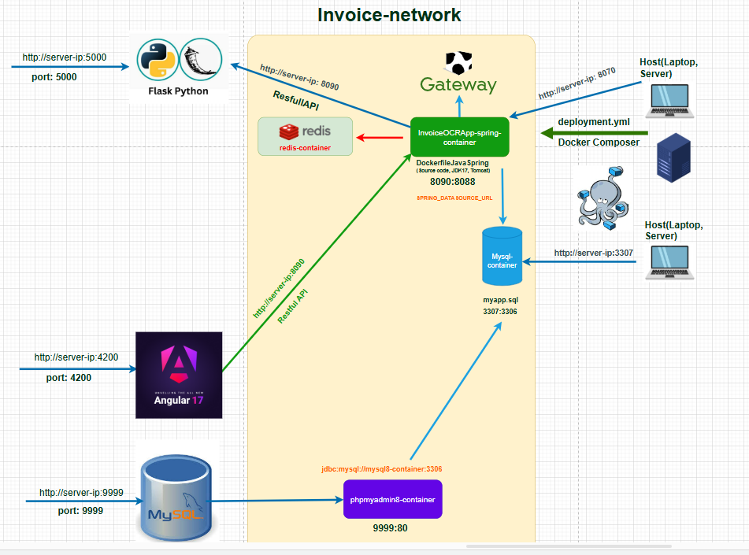

# Microservices-Based Multi-Format Invoice OCR System

## Video Demo & Paper
[View Demo & Research Paper](https://drive.google.com/drive/folders/1eXztyCl3HCcCGt2e18_DnpSyNrr_H8bY?usp=sharing)

## Overview
This is a **Flask-based application** for processing invoices using **OCR (Optical Character Recognition) and NLP (Natural Language Processing)**. The application allows users to:
- Upload invoices in multiple formats (**JPEG, PNG, PDF**).
- Extract text using **PaddleOCR**.
- Enhance text recognition and structure with **GPT-3.5 Turbo**.
- Store structured invoice data in a **MySQL database**.
- Manage invoices via a web-based **Angular 17 frontend**.
- Deploy using **Docker** with a microservices architecture.

## System Architecture


### Key Components:
1. **Frontend (Angular 17)**: Provides an intuitive UI for managing invoices.
2. **Backend (Flask + Spring Boot)**:
   - Flask handles OCR processing and integration with PaddleOCR.
   - Spring Boot serves as the API layer for invoice management.
3. **OCR Engine (PaddleOCR / Tesseract-OCR)**: Extracts text from invoices.
4. **NLP Engine (GPT-3.5 Turbo / spaCy)**: Enhances text recognition and corrects errors.
5. **Database (MySQL + Redis)**: Stores and retrieves invoice data efficiently.
6. **API Gateway**: Manages secure API communication between services.
7. **Deployment (Docker & Kubernetes)**: Enables scalable, cloud-native deployment.

## Installation
### Prerequisites
Ensure you have the following installed:
- **Python 3.8+**
- **Node.js & Angular CLI** (for frontend development)
- **MySQL** (for database storage)
- **Docker & Docker Compose** (for containerized deployment)

### Clone the Repository
```bash
git clone [github.com/TranNhatPhi/deployment](https://github.com/TranNhatPhi/deployment/)
```

### Install Backend Dependencies
```bash
cd backend
pip install -r requirements.txt
```

### Install Frontend Dependencies
```bash
cd frontend
npm install
```

### Configure Environment Variables
Create a **.env** file in the backend directory:
```ini
MYSQL_HOST=localhost
MYSQL_USER=root
MYSQL_PASSWORD=yourpassword
MYSQL_DB=invoices
REDIS_HOST=localhost
GPT_API_KEY=your_openai_api_key
```

### Start the Application
#### Run Backend (Flask + Spring Boot)
```bash
cd backend
python app.py  # Runs Flask OCR Service
cd ../spring-boot-api
mvn spring-boot:run  # Runs Java API
```

#### Run Frontend (Angular 17)
```bash
cd frontend
ng serve --open
```

## Usage
1. **Upload Invoice**: Navigate to the web UI and upload an invoice image or PDF.
2. **OCR Processing**: The system extracts text using PaddleOCR.
3. **NLP Enhancement**: The extracted text is processed and corrected using GPT-3.5.
4. **Structured Data Storage**: The extracted invoice data is saved in MySQL.
5. **Invoice Management**: Users can view, edit, and archive invoices.

## Deployment with Docker
To deploy the entire system using Docker:
```bash
docker-compose up --build
```

## Technologies Used
- **Flask (Python)** – OCR processing and backend logic
- **Spring Boot (Java)** – API layer for invoice management
- **Angular 17** – Frontend UI
- **PaddleOCR / Tesseract-OCR** – OCR text extraction
- **GPT-3.5 Turbo / spaCy** – NLP-based text correction
- **MySQL / Redis** – Data storage and caching
- **Docker & Kubernetes** – Containerized deployment
- **API Gateway** – Microservices integration

## System Diagram


## Contributors
- **Your Name** – Developer & AI Engineer

## License
This project is licensed under the MIT License.
